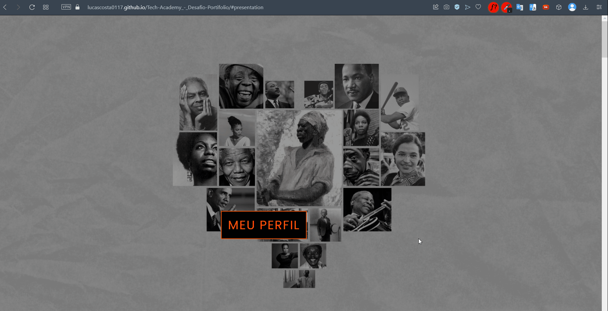

 
<!-- Gravar gif WEB-site em 1860x945 / Usar altura da  em 300em-->

---

# DESAFIO PORTIFÓLIO - TECH ACADEMY
<!-- Licensa MIT do GitHub-->

<!-- Índice para projetos maiores -->
## 📑 Índice
- [Sobre](#📋-sobre)
- [Funcionalidades](#💻-funcionalidades)
- [Tecnologias](#🔧-tecnologias)
- [Serviços Utilizados](#🖥-serviços-utilizados)
- [Agradecimentos](#🤝🏽-agradecimentos)
- [Autor](#✍🏽-autor)

 

---

<!-- Descrição incial do projeto -->
## 📋 Sobre 
Projeto baseado na criação de um portifólio profissional, o qual foi proposto em forma de  desafio durante o Módulo IV do curso Tech Academy. A finalidade desta atividade foi a criação uma página "dinâmica" com uso apenas de HTML e CSS. Como conteúdo, deveriamos expor na aplicação nossos projetos pessoais criados até aquele momento (um portfólio de fato), no meu caso, ainda iniciando na carreira de programação, decidi criar uma página em forma de "profile" para compartilhar um pouco sobre mim e minhas aptidões.

[Link da aplicação](https://lucascosta0117.github.io/Tech-Academy_-_Desafio-Portifolio/)

 

---

## 💻 Funcionalidades 
- [x] Expor diferentes seções no perfil
- [x] Criar animações e respostas visuais às interações do usuário
- [x] Permitir responsividade de tela

 

---

<!-- Inserir os links oficiais das tecnologias -->
## 🔧 Tecnologias 
- [HTML5](https://developer.mozilla.org/en-US/docs/Web/HTML)
- [CSS3](https://developer.mozilla.org/en-US/docs/Web/CSS)

 

---

## 🖥 Serviços Utilizados
- GitHub Pages

 

---

## 🤝🏽 Agradecimentos
Grato a StartSe e toda equipe envolvida no projeto Tech Academy que me permitiram ampliar todo conhecimento de Front End.
* [StartSe](https://www.linkedin.com/school/startse/)
* [Mentor(a) - Rafael do Prado](https://www.linkedin.com/in/rprrafa/)
* [Mentor(a) - Fernanda Araujo](https://www.linkedin.com/in/feraraujo/)
* [Instrutor(a) - Gabriel Custódio](https://www.linkedin.com/in/gabrielcustodio21/)
* [Instrutor(a) - Jorge Cunha](https://www.linkedin.com/in/jorge-felipe-cunha/)

 

---

## ✍🏽 Autor
Desenvolvido por Lucas Costa 👊🏽 [Linkedin](https://www.linkedin.com/in/lucas-costa-5a14a8239/)